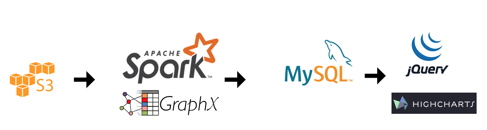

# Optimized computation of communities in large graphs

This project provides a distributed implementation of community detection algorithm on large graphs. This implements the Louvain community detection algorithm in a distributed way by taking advantaged of the neighborhood aggregation strategy employed in the algorithm.

This has been implemented using Spark and GraphX packages, using a simple data pipeline which can be easily extended to apply on any kinds of graphs.

1. [Introduction](README.md#introduction)
1. [Neighborhood Aggregation](#neighborhood-aggregation)
1. [Graph Partitioning Strategies](README.md#graph-partitioning-strategies)
1. [Pipeline and Deployment Instructions](README.md#pipeline-and-deployment-instructions)
1. [Performance metrics](README.md#performance-metrics)
1. [Datasets](README.md#datasets)
1. [Future work](README.md#future-work)

## Introduction

Graphs provide crucial information of interaction of various things in a given domain. Social network, graph of websites, academic citation networks, co-purchase statistic graph, protein-protein interaction are a few examples where we find really large graphs.  It is difficult for humans to comprehend large graphs and derive insights from them. It needs the aspect of data mining algorithms to help simplify things in a better way.

Community detection is the concept of identifying groups of similar things in a given network. Communities in graphs try to leverage the interactions (or edges) of the network and find communities with nodes that are closely connected. One of the popular measure to identify goodness of communities in a graph is modularity.

### Modularity
> Graphs with high modularity have **dense connections between the vertices within communities but sparse connections between nodes in different communities**. Modularity is often used in **optimization methods for detecting community structure in networks**.

Louvain community detection algorithm optimizes modularity by identifying the best community of a vertex among all its neighbors. It was initially published in 2008 by Blondel et.al from University of Louvain. The paper is given here. [https://arxiv.org/abs/0803.0476](https://arxiv.org/abs/0803.0476).

## Neighborhood Aggregation


## Pipeline and Deployment Instructions



#### Graph input file format

The graph is stored as a "Graph file" which is a list of edges in the graph. Each line of the graph will have the following format.
```
    # prefix comments in the file with a hash
    vertex1 <space or tab> vertex2
```

The algorithm is implemented for undirected version of the graph. Extension to directed version will be done in the next round of implementation.

#### Scala + Spark magic

The code is written using scala with SBT build. The web application is a java based web-app that queries the database to provide basic statistics about the communities.

```
    scala: 2.11.11
    sbt: 0.13.7
    spark: 2.2.1 (installed in the cluster, no specific methods that has been deprecated)
    MySQL: 14.14
    jQuery + highcharts: latest
    Tomcat: 9.0 (webapp to display results)
    Java EE Servlet: 3.0
```

You can use [`sbt assembly`](https://github.com/sbt/sbt-assembly) to build the FAT JAR.

## Graph Partitioning Strategies

## Performance metrics

## Datasets

## Future work


Analysis of communities => [bit.ly/close-circle](bit.ly/close-circle)
