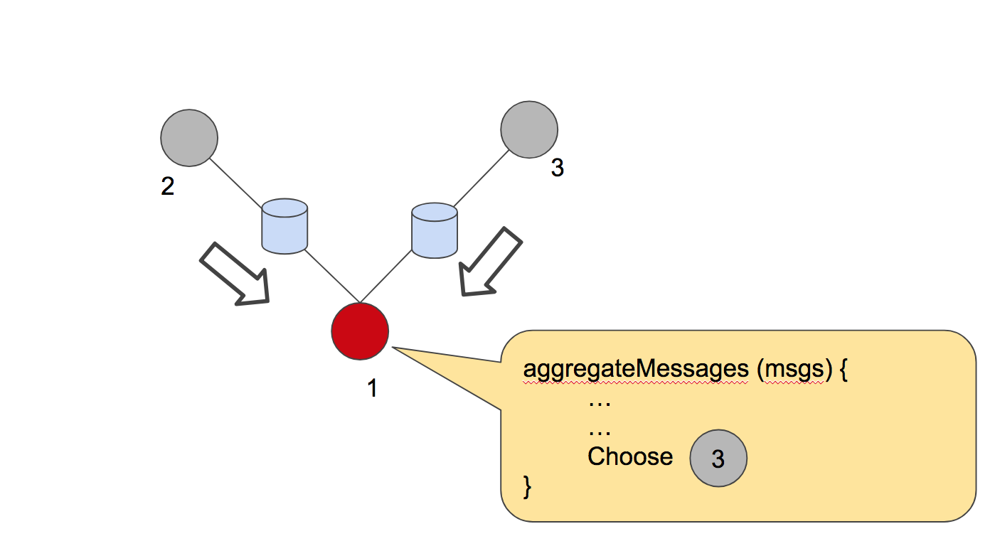

# Optimized computation of communities in large graphs

This project provides a distributed implementation of community detection algorithm on large graphs. This implements the Louvain community detection algorithm in a distributed way by taking advantaged of the neighborhood aggregation strategy employed in the algorithm.

This has been implemented using Spark and GraphX packages, using a simple data pipeline which can be easily extended to apply on any kinds of graphs.

1. [Introduction](#introduction)
1. [Business Aspect](#business-aspect)
1. [Neighborhood Aggregation](#neighborhood-aggregation)
1. [Pipeline and Deployment Instructions](#pipeline-and-deployment-instructions)
1. [Performance metrics](#performance-metrics)
1. [Datasets](#datasets)
1. [Future work](#future-work)

## Introduction

Graphs provide crucial information of interaction of various things in a given domain. Social network, graph of websites, academic citation networks, co-purchase statistic graph, protein-protein interaction are a few examples where we find really large graphs.  It is difficult for humans to comprehend large graphs and derive insights from them. It needs the aspect of data mining algorithms to help simplify things in a better way.

Community detection is the concept of identifying groups of similar things in a given network. Communities in graphs try to leverage the interactions (or edges) of the network and find communities with nodes that are closely connected. One of the popular measure to identify goodness of communities in a graph is modularity.

### Modularity
> Graphs with high modularity have **dense connections between the vertices within communities but sparse connections between nodes in different communities**. Modularity is often used in **optimization methods for detecting community structure in networks**.

Louvain community detection algorithm optimizes modularity by identifying the best community of a vertex among all its neighbors. It was initially published in 2008 by Blondel et.al from University of Louvain. The paper is given here. [https://arxiv.org/abs/0803.0476](https://arxiv.org/abs/0803.0476).

## Business Aspect

Community detection algorithm provides an insight on internal graph structure by identifying nodes that are very similar to each other. We can use this information to **provide targeted services** to many users. For instance, a small scale software company can target their ads to user groups who are interested in new advancements in their domain rather than randomly choosing users to provide ad impressions. This reduces cost for the company and can have a better throughput for their efforts.

Community detection also helps in **reducing the search space** in search engines where we can provide relevant documents in the community (or cluster) of the documents identified by the inverted index, instead of searching the entire document space.

## Neighborhood Aggregation

The following section discusses the parallelism in the algorithm that has been used to gain performance advantage. Readers can refer to the paper to get better understanding of the original algorithm.

The algorithm assigns a vertex to a community based on the communities structures of its neighbors. The community of 1 is decided by checking the gain in modularity by adding 1 to the community of 2 or community of 3. If there is negative gain, vertex 1 remains in its own community.


Here lies the parallelism that can be leveraged. GraphX stores the graph in a edge based partitioning strategy, where each edge is given as a triplet as given below. The triplets are stored as an RDD and partitioned across nodes. The change in modularity of adding a node to its neighbor's community is calculated and stored in each of the edge as shown below.


Spark RDDs can be transformed into new RDDs. GraphX uses similar strategy when transforming the EdgeRDD when we apply a `map` operation on the triplets. The information about change in modularity can be transmitted to the vertices using `aggregateMessages()` function in GraphX. The decision to choose a node is identified in a `vertexProg` and




## Pipeline and Deployment Instructions


#### Graph input file format

The graph is stored as a "Graph file" which is a list of edges in the graph. Each line of the graph will have the following format.
```
    # prefix comments in the file with a hash
    vertex1 <space or tab> vertex2
```

The algorithm is implemented for undirected version of the graph. Extension to directed version will be done in the next round of implementation.

#### Scala + Spark magic

The code is written using scala with SBT build. The web application is a java based web-app that queries the database to provide basic statistics about the communities.

```
    scala: 2.11.11
    sbt: 0.13.7
    spark: 2.2.1 (installed in the cluster, no specific methods that has been deprecated)
    MySQL: 14.14
    jQuery + highcharts: latest
    Tomcat: 9.0 (webapp to display results)
    Java EE Servlet: 3.0
```

You can use [`sbt assembly`](https://github.com/sbt/sbt-assembly) to build the FAT JAR.

## Performance metrics

Here is the configuration of spark cluster.

```
    7 m4.large instances
    1 master - 7 workers
    memory: 8G
    disk: 100G
    cores: 6 per machine (36 in total).

    executor memory: 5.5G
    driver memory: 5G (to support aggregateMessages() to work fine)

```

The distributed implementation has been compared with a single-machine implementation of the algorithm. I have used off-the shelf implementation of louvain algorithm given by [taynaud/python-louvain](https://github.com/taynaud/python-louvain), which uses [networkx](https://networkx.github.io/) graph internally. The algorithm is present in `single-machine/louvain.py`. Single machine implementation was run on the master node of the spark cluster. The cluster is dedicated to run these algorithms and not `time-shared`.


The single-machine implementation finish to perform when tested on a graph with 4 million nodes and 34 million edges. The distributed version completed successfully in 1 hour.

## Datasets

The algorithm has been tested across 5 different datasets provided in [SNAP](https://snap.stanford.edu/data/).

| Dataset | Vertices | Edges |
|-|-|-|
|email-Eu-core|1,005|25,571|
|com-Amazon|334,863|925,872|
|com-DBLP|317,080|1,049,866|
|com-Youtube|1,134,890|2,987,624|
|com-LiveJournal|3,997,962|34,681,189|

## Conclusion & Future work

This project has successfully demonstrated the ease in parallelizing the community detection algorithm. The inherent parallelism has been leveraged to achieve this.

Some of the future work on this.
1. Reduce the number of information passed on each of the edge over `aggregateMessages()`, use better serialization format to avoid delays due to this.
1. Persist infomrmation that may not be needed in the current iteration on to the disk to reduce memory utilization.
1. Use a better architecture of the clusters with more memory and disk.


Analysis of communities => [bit.ly/close-circle](bit.ly/close-circle)
